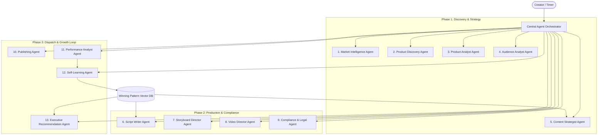

# AI Agent Architecture & Orchestrator Design

## 1. Multi-Agent System Architecture

The platform operates on a central **Agent Orchestrator** managing 13 specialized micro-agents. Agents do not call each other randomly; instead, execution follows deterministic workflow state graphs with strict Pydantic JSON input/output validation.



---

## 2. Comprehensive Agent Directory & Specifications

### 1. Market Intelligence Agent
- **Role**: Continuous ingestion & trend signal detection across Thai social commerce.
- **Input**: Category IDs, keyword trend feeds, platform bestseller feeds.
- **Output Schema**:
```json
{
  "trending_keywords": ["เซรั่มลดสิว", "แก้วเก็บความเย็น 24 ชม."],
  "rising_categories": ["Skincare", "Home & Living"],
  "momentum_score": 88.5
}
```

### 2. Product Discovery Agent
- **Role**: Normalizes product catalogs and computes multi-factor opportunity scores.
- **Scoring Weights**: Configurable weights for Demand, Growth, Commission, Reviews, Competition, and Momentum.
- **Output Schema**:
```json
{
  "external_product_id": "SP-TH-994821",
  "opportunity_score": 92.4,
  "classification": "HIGH_PRIORITY",
  "scoring_breakdown": {
    "demand": 95, "growth": 90, "commission": 85, "competition": 70
  }
}
```

### 3. Product Analyst Agent
- **Role**: Deep product tear-down (USP, flaws, purchase objections, competitor gaps).
- **Output Schema**: `ProductIntelligenceCard` (11 core sections in Thai).

### 4. Audience Analyst Agent
- **Role**: Profiles Thai customer segments (e.g. Gen Z college students vs Gen Y working moms), emotional triggers, and price sensitivity.

### 5. Content Strategist Agent
- **Role**: Synthesizes 10+ distinct creative angles tailored to the product and audience profile.
- **Angles**: Problem $\to$ Solution, Before $\to$ After, Demo, Myth vs Reality, Things I Wish I Knew, etc.

### 6. Script Writer Agent
- **Role**: Writes high-conversion, natural Thai scripts with strict pacing guidelines (15s, 20s, 30s, 45s, 60s).
- **Core Prompt Philosophy**: Speak like an actual Thai creator (เป็นกันเอง, ไม่โฆษณาแข็งทื่อ, ฮุกสะดุดหยุดนิ้วใน 2 วินาทีแรก).

### 7. Storyboard Director Agent
- **Role**: Translates script lines into sequential shots (Camera movements, on-screen Thai kinetic text, SFX cues, B-roll timing).

### 8. Video Director Agent
- **Role**: Coordinates the FFmpeg rendering pipeline (Voice synthesis, clip assembly, subtitle styling, audio ducking).

### 9. Compliance & Legal Agent
- **Role**: Scans generated copy and visuals against Thai FDA (อย.) guidelines, OCPB (สคบ.) fair pricing rules, and platform TOS.
- **Output Schema**:
```json
{
  "verdict": "WARNING",
  "flags": [
    {
      "term": "ขาวทันที",
      "severity": "HIGH",
      "law_reference": "พ.ร.บ. เครื่องสำอาง พ.ศ. 2558",
      "suggested_replacement": "ช่วยให้ผิวแลดูกระจ่างใสขึ้นอย่างเป็นธรรมชาติ"
    }
  ],
  "safe_script": "..."
}
```

### 10. Publishing Agent
- **Role**: Prepares and schedules video payload, tags affiliate anchors, formats hashtags, and monitors upload statuses.

### 11. Performance Analyst Agent
- **Role**: Analyzes engagement drop-offs, hook retention, CTR, and conversion rates to deduce root causes.

### 12. Self-Learning Agent
- **Role**: Extracts winning patterns from top-performing creatives and updates the vector memory library.

### 13. Executive Recommendation Agent ("What should I do today?")
- **Role**: Synthesizes real-time performance data and market shifts into 3 clear daily high-ROI directives for the creator.
