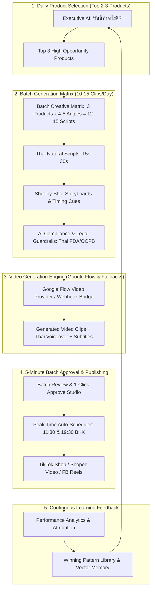
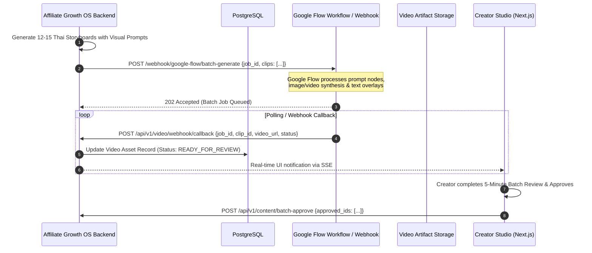
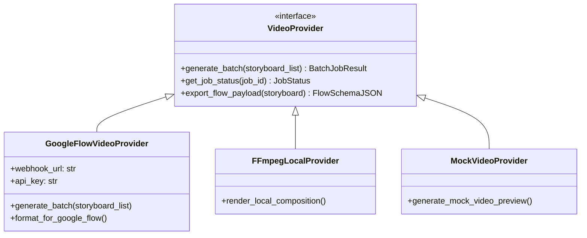

# Architecture Specification: AI Affiliate Content Automation Platform (Affiliate Growth OS)
## With 10–15 Daily Clips Batch Engine & Google Flow Video Pipeline

---

## 1. System Overview & Philosophy

The **Affiliate Growth Operating System** is built for high-throughput Thai affiliate content creators who need to generate **10–15 high-converting video clips daily** for **TikTok Shop, Shopee Video, and Facebook Reels**.

To achieve this velocity without sacrificing creative quality or legal compliance, the architecture integrates a **Batch Creative Matrix Engine** and a dedicated **Google Flow / Google AI Video Provider**.

---

## 2. Google Flow Video Provider & Webhook Bridge

The platform provides a dedicated `GoogleFlowVideoProvider` that seamlessly interfaces with Google Flow / Google Vertex AI / Veo / Imagen workflows.

---

## 3. High-Level Technology Stack

| Layer | Technology Choice | Rationale |
|---|---|---|
| **Frontend UI** | **Next.js 14 (App Router) + TypeScript + TailwindCSS + Shadcn UI** | High-performance batch approval studio, real-time video player grid, Thai typography. |
| **Backend API & Orchestrator** | **FastAPI (Python 3.11+) + AsyncPG + Celery Worker** | High-concurrency async generation, event bus, and webhook callback receivers. |
| **Database & Vector Store** | **PostgreSQL 16 + pgvector** | Relational metrics, campaign tracking, and semantic search for winning Thai hooks. |
| **Video Engine Layer** | **Google Flow Provider + FFmpeg Processing Layer + Mock Provider** | Native Google Flow integration, local FFmpeg fallback for instant testing. |
| **Storage** | **S3-compatible Object Storage (MinIO / Cloudflare R2 / Google Cloud Storage)** | Secure hosting for generated video renders and audio tracks. |

---

## 4. Provider Abstraction Layer (Zero Vendor Lock-in)

