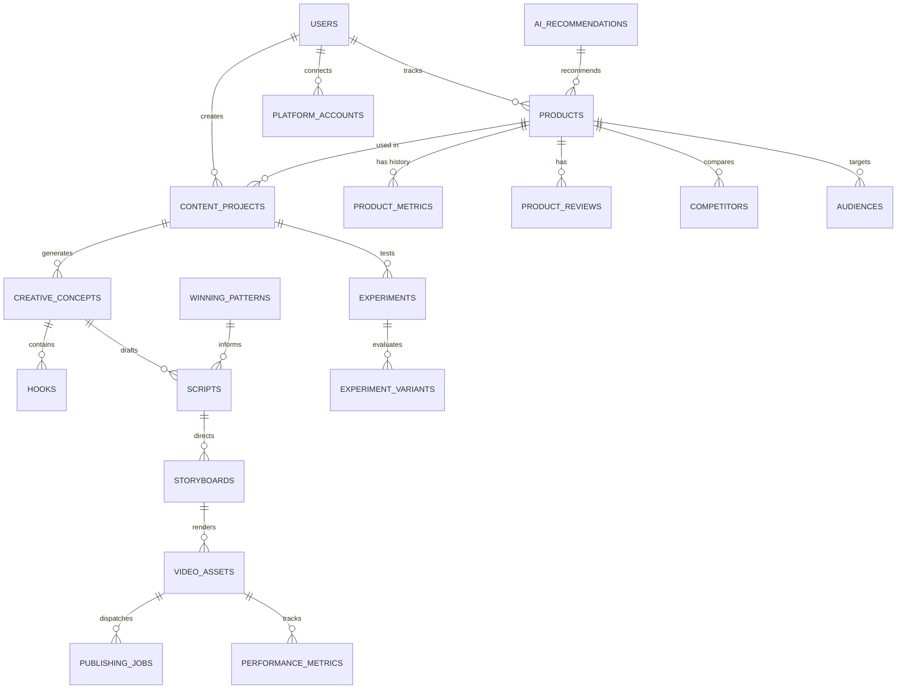

# Database Schema Design: PostgreSQL 16 + pgvector

## 1. Schema Overview

The database design provides a normalized, scalable, and audit-ready relational model with `JSONB` flexibility for unstructured AI metadata and `pgvector` for semantic similarity search over winning scripts and hooks.

---

## 2. Entity Relationship Diagram (ERD)



---

## 3. Detailed Table Definitions (DDL)

```sql
-- Extensions
CREATE EXTENSION IF NOT EXISTS "uuid-ossp";
CREATE EXTENSION IF NOT EXISTS "vector";

-- 1. USERS & WORKSPACES
CREATE TABLE users (
    id UUID PRIMARY KEY DEFAULT uuid_generate_v4(),
    email VARCHAR(255) UNIQUE NOT NULL,
    full_name VARCHAR(255) NOT NULL,
    role VARCHAR(50) DEFAULT 'CREATOR', -- OWNER, CREATOR, EDITOR, VIEWER
    timezone VARCHAR(50) DEFAULT 'Asia/Bangkok',
    settings JSONB DEFAULT '{}'::jsonb,
    created_at TIMESTAMPTZ DEFAULT CURRENT_TIMESTAMP,
    updated_at TIMESTAMPTZ DEFAULT CURRENT_TIMESTAMP
);

-- 2. PLATFORM ACCOUNTS (TikTok Shop, Shopee, Meta)
CREATE TABLE platform_accounts (
    id UUID PRIMARY KEY DEFAULT uuid_generate_v4(),
    user_id UUID NOT NULL REFERENCES users(id) ON DELETE CASCADE,
    platform VARCHAR(50) NOT NULL, -- TIKTOK_SHOP, SHOPEE_VIDEO, FB_REELS
    account_name VARCHAR(255) NOT NULL,
    auth_credentials JSONB NOT NULL DEFAULT '{}'::jsonb, -- Encrypted tokens
    status VARCHAR(50) DEFAULT 'CONNECTED', -- CONNECTED, EXPIRED, DISCONNECTED
    created_at TIMESTAMPTZ DEFAULT CURRENT_TIMESTAMP,
    updated_at TIMESTAMPTZ DEFAULT CURRENT_TIMESTAMP
);

-- 3. PRODUCTS
CREATE TABLE products (
    id UUID PRIMARY KEY DEFAULT uuid_generate_v4(),
    user_id UUID REFERENCES users(id) ON DELETE SET NULL,
    platform_source VARCHAR(50) NOT NULL, -- TIKTOK_SHOP, SHOPEE, LAZADA
    external_product_id VARCHAR(255) NOT NULL,
    title_th TEXT NOT NULL,
    title_en TEXT,
    category VARCHAR(100) NOT NULL,
    brand VARCHAR(100),
    original_price NUMERIC(12, 2) NOT NULL,
    sale_price NUMERIC(12, 2) NOT NULL,
    discount_pct NUMERIC(5, 2) DEFAULT 0.0,
    commission_rate NUMERIC(5, 2) NOT NULL, -- e.g. 15.00 for 15%
    estimated_commission NUMERIC(12, 2) GENERATED ALWAYS AS (sale_price * commission_rate / 100.0) STORED,
    total_sales INTEGER DEFAULT 0,
    monthly_sales INTEGER DEFAULT 0,
    rating NUMERIC(3, 2) DEFAULT 0.0,
    review_count INTEGER DEFAULT 0,
    product_url TEXT NOT NULL,
    thumbnail_url TEXT,
    image_gallery JSONB DEFAULT '[]'::jsonb,
    
    -- Scoring
    opportunity_score NUMERIC(5, 2) DEFAULT 0.0,
    demand_score NUMERIC(5, 2) DEFAULT 0.0,
    trend_score NUMERIC(5, 2) DEFAULT 0.0,
    competition_score NUMERIC(5, 2) DEFAULT 0.0,
    content_potential_score NUMERIC(5, 2) DEFAULT 0.0,
    classification VARCHAR(50) DEFAULT 'TEST', -- HIGH_PRIORITY, TEST, WATCH, KILL
    
    ai_summary JSONB DEFAULT '{}'::jsonb, -- Product Intelligence Card
    status VARCHAR(50) DEFAULT 'ACTIVE',
    created_at TIMESTAMPTZ DEFAULT CURRENT_TIMESTAMP,
    updated_at TIMESTAMPTZ DEFAULT CURRENT_TIMESTAMP
);

CREATE INDEX idx_products_opp_score ON products(opportunity_score DESC);
CREATE INDEX idx_products_classification ON products(classification);
CREATE INDEX idx_products_category ON products(category);

-- 4. PRODUCT METRICS (Time Series Tracking)
CREATE TABLE product_metrics (
    id UUID PRIMARY KEY DEFAULT uuid_generate_v4(),
    product_id UUID NOT NULL REFERENCES products(id) ON DELETE CASCADE,
    recorded_date DATE NOT NULL,
    daily_sales INTEGER DEFAULT 0,
    price NUMERIC(12, 2) NOT NULL,
    growth_rate_7d NUMERIC(5, 2) DEFAULT 0.0,
    stock_level INTEGER,
    created_at TIMESTAMPTZ DEFAULT CURRENT_TIMESTAMP
);
CREATE INDEX idx_product_metrics_date ON product_metrics(product_id, recorded_date DESC);

-- 5. CONTENT PROJECTS
CREATE TABLE content_projects (
    id UUID PRIMARY KEY DEFAULT uuid_generate_v4(),
    user_id UUID NOT NULL REFERENCES users(id) ON DELETE CASCADE,
    product_id UUID NOT NULL REFERENCES products(id) ON DELETE CASCADE,
    campaign_name VARCHAR(255) NOT NULL,
    target_platforms JSONB DEFAULT '["TIKTOK_SHOP", "SHOPEE_VIDEO"]'::jsonb,
    target_audiences JSONB DEFAULT '[]'::jsonb,
    status VARCHAR(50) DEFAULT 'PLANNING', -- PLANNING, GENERATING, READY_FOR_REVIEW, ACTIVE, COMPLETED
    created_at TIMESTAMPTZ DEFAULT CURRENT_TIMESTAMP,
    updated_at TIMESTAMPTZ DEFAULT CURRENT_TIMESTAMP
);

-- 6. CREATIVE CONCEPTS & HOOKS
CREATE TABLE creative_concepts (
    id UUID PRIMARY KEY DEFAULT uuid_generate_v4(),
    project_id UUID NOT NULL REFERENCES content_projects(id) ON DELETE CASCADE,
    angle_type VARCHAR(100) NOT NULL, -- PROBLEM_SOLUTION, BEFORE_AFTER, DEMO, MYTH_BUST, PRICE_VALUE, etc.
    concept_title_th VARCHAR(255) NOT NULL,
    core_message_th TEXT NOT NULL,
    visual_direction TEXT,
    viral_potential_score NUMERIC(5, 2) DEFAULT 0.0,
    conversion_potential_score NUMERIC(5, 2) DEFAULT 0.0,
    created_at TIMESTAMPTZ DEFAULT CURRENT_TIMESTAMP
);

CREATE TABLE hooks (
    id UUID PRIMARY KEY DEFAULT uuid_generate_v4(),
    concept_id UUID NOT NULL REFERENCES creative_concepts(id) ON DELETE CASCADE,
    hook_type VARCHAR(100) NOT NULL, -- CURIOSITY, SHOCK, CONTROVERSY, DIRECT_PAIN, PROMISE
    hook_text_th TEXT NOT NULL,
    hook_visual_th TEXT,
    embedding vector(1536), -- Vector representation for semantic analysis
    ctr_historical NUMERIC(5, 2) DEFAULT 0.0,
    created_at TIMESTAMPTZ DEFAULT CURRENT_TIMESTAMP
);

-- 7. SCRIPTS & STORYBOARDS
CREATE TABLE scripts (
    id UUID PRIMARY KEY DEFAULT uuid_generate_v4(),
    concept_id UUID NOT NULL REFERENCES creative_concepts(id) ON DELETE CASCADE,
    hook_id UUID REFERENCES hooks(id) ON DELETE SET NULL,
    duration_target_sec INTEGER NOT NULL DEFAULT 30, -- 15, 20, 30, 45, 60
    style_persona VARCHAR(100) NOT NULL DEFAULT 'AUTHENTIC_CASUAL',
    script_body_th TEXT NOT NULL,
    voiceover_th TEXT NOT NULL,
    call_to_action_th TEXT NOT NULL,
    estimated_word_count INTEGER NOT NULL,
    compliance_status VARCHAR(50) DEFAULT 'PENDING', -- PENDING, PASS, WARNING, FAIL
    compliance_report JSONB DEFAULT '{}'::jsonb,
    created_at TIMESTAMPTZ DEFAULT CURRENT_TIMESTAMP,
    updated_at TIMESTAMPTZ DEFAULT CURRENT_TIMESTAMP
);

CREATE TABLE storyboards (
    id UUID PRIMARY KEY DEFAULT uuid_generate_v4(),
    script_id UUID NOT NULL REFERENCES scripts(id) ON DELETE CASCADE,
    scenes JSONB NOT NULL DEFAULT '[]'::jsonb, -- Array of shot definitions
    total_duration_sec NUMERIC(5, 2) NOT NULL,
    created_at TIMESTAMPTZ DEFAULT CURRENT_TIMESTAMP
);

-- 8. VIDEO ASSETS & RENDERS
CREATE TABLE video_assets (
    id UUID PRIMARY KEY DEFAULT uuid_generate_v4(),
    script_id UUID NOT NULL REFERENCES scripts(id) ON DELETE CASCADE,
    storyboard_id UUID NOT NULL REFERENCES storyboards(id) ON DELETE CASCADE,
    video_url TEXT,
    thumbnail_url TEXT,
    audio_track_url TEXT,
    duration_sec NUMERIC(5, 2),
    resolution VARCHAR(50) DEFAULT '1080x1920', -- 9:16 vertical
    render_status VARCHAR(50) DEFAULT 'DRAFT', -- DRAFT, RENDERING, READY, FAILED
    approval_status VARCHAR(50) DEFAULT 'PENDING', -- PENDING, APPROVED, REJECTED
    approval_notes TEXT,
    created_at TIMESTAMPTZ DEFAULT CURRENT_TIMESTAMP,
    updated_at TIMESTAMPTZ DEFAULT CURRENT_TIMESTAMP
);

-- 9. PUBLISHING JOBS
CREATE TABLE publishing_jobs (
    id UUID PRIMARY KEY DEFAULT uuid_generate_v4(),
    video_asset_id UUID NOT NULL REFERENCES video_assets(id) ON DELETE CASCADE,
    platform_account_id UUID NOT NULL REFERENCES platform_accounts(id) ON DELETE CASCADE,
    platform VARCHAR(50) NOT NULL,
    caption_th TEXT NOT NULL,
    hashtags JSONB DEFAULT '[]'::jsonb,
    product_anchor_url TEXT NOT NULL,
    scheduled_at TIMESTAMPTZ,
    published_at TIMESTAMPTZ,
    external_post_id VARCHAR(255),
    status VARCHAR(50) DEFAULT 'SCHEDULED', -- SCHEDULED, PUBLISHING, PUBLISHED, FAILED, RETRYING
    error_message TEXT,
    created_at TIMESTAMPTZ DEFAULT CURRENT_TIMESTAMP,
    updated_at TIMESTAMPTZ DEFAULT CURRENT_TIMESTAMP
);

-- 10. PERFORMANCE METRICS
CREATE TABLE performance_metrics (
    id UUID PRIMARY KEY DEFAULT uuid_generate_v4(),
    publishing_job_id UUID NOT NULL REFERENCES publishing_jobs(id) ON DELETE CASCADE,
    recorded_at TIMESTAMPTZ DEFAULT CURRENT_TIMESTAMP,
    views INTEGER DEFAULT 0,
    reach INTEGER DEFAULT 0,
    likes INTEGER DEFAULT 0,
    comments INTEGER DEFAULT 0,
    shares INTEGER DEFAULT 0,
    saves INTEGER DEFAULT 0,
    watch_time_total_sec NUMERIC(14, 2) DEFAULT 0.0,
    completion_rate NUMERIC(5, 2) DEFAULT 0.0,
    ctr NUMERIC(5, 2) DEFAULT 0.0,
    product_clicks INTEGER DEFAULT 0,
    orders INTEGER DEFAULT 0,
    conversion_rate NUMERIC(5, 2) DEFAULT 0.0,
    gmv NUMERIC(12, 2) DEFAULT 0.0,
    commission_earned NUMERIC(12, 2) DEFAULT 0.0
);

-- 11. WINNING PATTERNS & SELF-LEARNING
CREATE TABLE winning_patterns (
    id UUID PRIMARY KEY DEFAULT uuid_generate_v4(),
    pattern_type VARCHAR(100) NOT NULL, -- WINNING_HOOK, WINNING_ANGLE, WINNING_DURATION, WINNING_CTA
    category VARCHAR(100) NOT NULL,
    pattern_summary_th TEXT NOT NULL,
    structural_template TEXT NOT NULL,
    sample_text_th TEXT NOT NULL,
    avg_ctr NUMERIC(5, 2) DEFAULT 0.0,
    avg_cvr NUMERIC(5, 2) DEFAULT 0.0,
    sample_size INTEGER DEFAULT 1,
    confidence_score NUMERIC(5, 2) DEFAULT 0.0,
    embedding vector(1536),
    created_at TIMESTAMPTZ DEFAULT CURRENT_TIMESTAMP,
    updated_at TIMESTAMPTZ DEFAULT CURRENT_TIMESTAMP
);

-- 12. AI EXECUTIVE RECOMMENDATIONS ("What Should I Do Today?")
CREATE TABLE ai_recommendations (
    id UUID PRIMARY KEY DEFAULT uuid_generate_v4(),
    user_id UUID NOT NULL REFERENCES users(id) ON DELETE CASCADE,
    product_id UUID REFERENCES products(id) ON DELETE SET NULL,
    priority VARCHAR(50) DEFAULT 'HIGH', -- URGENT, HIGH, MEDIUM, LOW
    headline_th VARCHAR(255) NOT NULL,
    reasoning_th TEXT NOT NULL,
    action_type VARCHAR(100) NOT NULL, -- CREATE_CAMPAIGN, SCALE_WINNER, SUNSET_CREATIVE, ADJUST_PRICE
    action_payload JSONB DEFAULT '{}'::jsonb,
    is_dismissed BOOLEAN DEFAULT FALSE,
    is_completed BOOLEAN DEFAULT FALSE,
    created_at TIMESTAMPTZ DEFAULT CURRENT_TIMESTAMP
);
```
