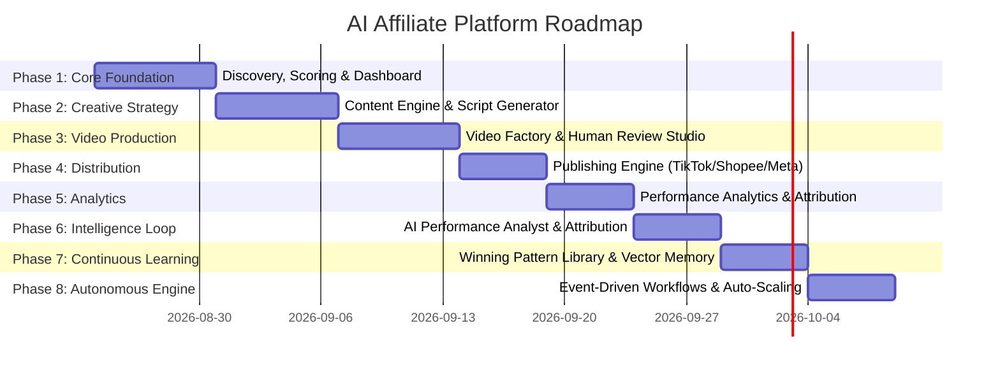

# Development Roadmap & Implementation Order

---

## Overview

The platform development is structured in **8 sequential phases**. Each phase produces a fully operational, testable increment of the system.

---

## Phase Details & Deliverables

### Phase 1: Dashboard, Product Discovery, Scoring & Product Intelligence
- **Frontend**: Next.js 14 App Shell, Executive Dashboard, "What should I do today?" directive panel, Product Discovery explorer table, Configurable weights modal, and Product Intelligence Card view.
- **Backend**: FastAPI core, PostgreSQL schemas, Product Discovery Agent, Product Opportunity Scoring Algorithm, Product Analyst Agent, Mock product dataset for Thai social commerce (100+ realistic products).

### Phase 2: Content Strategy, Script & Storyboard Generator
- **Frontend**: Campaign Studio, 10 Creative Angle visualizer, Thai Script Editor (15s, 20s, 30s, 45s, 60s), Shot-by-shot Storyboard preview.
- **Backend**: Content Strategist Agent, Script Writer Agent (culturally calibrated Thai prompts), Storyboard Director Agent, Pydantic structured output models.

### Phase 3: Video Factory, Content Library & Human Approval
- **Frontend**: Side-by-side Video Review Player, Inline Subtitle & Hook editor, Batch Action Bar, Content Library with status filters (Draft, Review, Approved, Published, Winner).
- **Backend**: Video Factory rendering pipeline (FFmpeg subtitle overlay + audio mixing), Voice synthesis interface (Thai Edge-TTS / ElevenLabs / Mock), Compliance Guardrail Agent (Thai FDA/OCPB keyword scanner).

### Phase 4: Multi-Platform Publishing Center
- **Frontend**: Publishing Queue, Channel Connect modal (TikTok Shop, Shopee Video, Facebook Reels), Scheduling Calendar.
- **Backend**: `PublishingProvider` abstraction, Scheduled worker jobs, Thai caption/hashtag generator with automated affiliate link injection.

### Phase 5: Performance Analytics & Dashboard Ingestion
- **Frontend**: Analytics Hub, Multi-metric chart visualizer (Views, CTR, Orders, GMV, Commission), Creative Leaderboard, Underperforming Alerts.
- **Backend**: Performance ingestion webhooks, Time-series metrics aggregator, ROI calculation engine.

### Phase 6: AI Performance Analyst
- **Frontend**: "Why it won / Why it lost" diagnostic drawers, Creative teardown inspector.
- **Backend**: Performance Analyst Agent analyzing view-through curves and conversion drop-offs.

### Phase 7: Self-Learning & Winning Pattern Library
- **Frontend**: Winning Pattern Matrix (Top Hooks, Top Angles, Optimal Durations), Vector similarity search for matching winning templates.
- **Backend**: Self-Learning Agent, pgvector embeddings integration for scripts & hooks, feedback loop updating prompt directives.

### Phase 8: Fully Automated Workflows & Experiment Engine
- **Frontend**: A/B Experiment manager (Multi-variant test launcher), Automation trigger settings.
- **Backend**: Event-Driven Orchestrator, Winner auto-scaling workflow (auto-generating 5 variants of a proven winning video).
