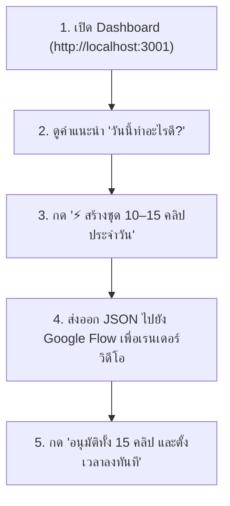

# คู่มือการใช้งาน: AI Affiliate Content Automation Platform
## (ระบบผลิตคอนเทนต์นายหน้า 10–15 คลิป/วัน เชื่อมต่อ Google Flow)

---

## 📌 1. ภาพรวมการใช้งานประจำวัน (Daily Routine)

ในฐานะครีเอเตอร์นายหน้า คุณใช้เวลาเพียง **5–10 นาทีต่อวัน** ในการจัดการคอนเทนต์ 15 คลิป:



---

## 🚀 2. ขั้นตอนการใช้งานแบบละเอียด

### ขั้นตอนที่ 1: เข้าสู่ระบบ Dashboard
1. เปิดเบราว์เซอร์ไปที่: **`http://localhost:3001`**
2. หน้าจอจะแสดง:
   - **ยอดขายสะสม (GMV)** และ **ค่าคอมมิชชั่นสุทธิ (฿)**
   - **แผง AI Directive ("🎯 วันนี้ทำอะไรดี?")** ที่ประเมินโอกาสสร้างยอดขายของวันนี้

---

### ขั้นตอนที่ 2: สร้างชุด 10–15 คลิปใน 1 คลิก
1. ในแถบสีม่วงด้านบน คลิกปุ่ม:
   > **`⚡ สร้างชุด 10–15 คลิปประจำวันสำหรับ Google Flow`**
2. ระบบจะทำการ:
   - คัดเลือกสินค้าที่มีคะแนนโอกาสสูงสุด 2–3 ตัว
   - สร้างมุมมองเนื้อหาที่หลากหลาย (Problem $\to$ Solution, Before $\to$ After, ป้ายยาโปรเด็ด, Day in Life) รวม 15 สคริปต์
   - สร้างฮุกหยุดนิ้ว 0–3 วินาทีแรก (ภาษาไทยธรรมชาติ)
   - ตรวจสอบคำเคลมเกินจริงตามกฎหมาย อย. และ สคบ. อัตโนมัติ

---

### ขั้นตอนที่ 3: ตรวจดูสตอรี่บอร์ด & สคริปต์
1. ในแผง **"สตูดิโอตรวจอนุมัติ & ส่งเข้า Google Flow"**:
   - รายการ 15 คลิปจะแสดงอยู่ฝั่งซ้าย พร้อมเวลาแนะนำในการโพสต์ (เช่น *11:30 น. ช่วงพักเที่ยง, 19:45 น. ช่วงทองหลังอาหารเย็น*)
   - คลิกที่คลิปใดก็ได้เพื่อดูรายละเอียด:
     - **ข้อความฮุก 0–3 วินาทีแรก**
     - **เสียงพากย์ฉบับเต็ม**
     - **สตอรี่บอร์ดแยก 4 ช็อต** (พร้อมคำอธิบายภาพและ Prompt สำหรับ AI)
     - **แถบตรวจ อย./สคบ. PASS**

---

### ขั้นตอนที่ 4: การนำไปใช้ใน Google Flow
มี 2 วิธีในการนำข้อมูลไปเรนเดอร์วิดีโอด้วย Google Flow:

#### วิธีที่ A: ส่งออกไฟล์ JSON (แนะนำสำหรับ Google Flow Node)
1. คลิกปุ่ม **`"ส่งออก JSON สำหรับ Google Flow"`** (สีเทา)
2. เบราว์เซอร์จะดาวน์โหลดไฟล์ `google_flow_batch_xxx.json`
3. นำไฟล์ JSON นี้ไปอัปโหลดเข้า Workflow ใน Google Flow ซึ่งจะมีข้อมูล:
   - `duration_sec`: ความยาววิดีโอ (15s, 20s, 30s)
   - `aspect_ratio`: 9:16 (แนวตั้งสำหรับ TikTok/Shopee/Reels)
   - `thai_voice_actor`: เสียงพากย์ภาษาไทย
   - `visual_prompts`: Prompt ภาษาอังกฤษแยกช็อตสำหรับ AI Image/Video generator
   - `burned_captions`: ข้อความซับไตเติลภาษาไทยพร้อมตำแหน่ง

#### วิธีที่ B: เชื่อมต่อผ่าน Webhook อัตโนมัติ
- Backend ของระบบมี Webhook Endpoint รองรับการยิงตรงจาก Google Flow ที่:
  `POST http://localhost:8000/api/v1/batch/generate-15-clips`

---

### ขั้นตอนที่ 5: ตรวจอนุมัติและตั้งเวลาโพสต์
1. หลังจากตรวจดูความเรียบร้อยแล้ว คลิกปุ่มสีเขียว:
   > **`"อนุมัติทั้ง 15 คลิป และตั้งเวลาลงทันที"`**
2. ระบบจะบันทึกสถานะเป็น `APPROVED` และจัดคิวโพสต์ตามช่วงเวลาทองของไทยโดยอัตโนมัติ

---

## 🔍 3. การวิเคราะห์สินค้าเฉพาะตัว (Product Deep Dive)

หากคุณมีสินค้าที่สนใจเป็นพิเศษในตารางด้านล่าง:
1. เลื่อนลงมาที่ตาราง **"สำรวจและคัดกรองสินค้าศักยภาพสูง (Product Discovery)"**
2. สามารถค้นหาชื่อสินค้า หรือเลือกหมวดหมู่ (*สกินแคร์, ของใช้ในครัว, แกดเจ็ต*)
3. คลิกปุ่ม **`"วิเคราะห์ AI"`** ที่สินค้านั้น
4. ระบบจะเปิด **Product Intelligence Card (11 ส่วน)** แสดง:
   - ปัญหาของลูกค้า (Pain Points) & จุดขาย (USP)
   - ข้อโต้แย้งที่ลูกค้ามักลังเลก่อนซื้อ พร้อมคำตอบแก้ข้อโต้แย้ง
   - 3 อันดับฮุกภาษาไทยที่คาดการณ์อัตราการหยุดดู (3s Retention) สูงสุด
5. คลิกปุ่ม **`"สร้าง 5 คลิปทันที"`** เพื่อสร้างชุดคอนเทนต์เฉพาะสินค้านั้น

---

## 🛠️ 4. วิธีการเปิด/ปิดระบบ (Start & Stop Commands)

หากต้องการเปิดใช้งานระบบใหม่ในภายหลัง:

### เปิด Backend (FastAPI):
```powershell
cd c:\Users\user\Downloads\affiliate-ai-platform\backend
python -m uvicorn app.main:app --host 127.0.0.1 --port 8000
```
- API Docs: `http://localhost:8000/docs`

### เปิด Frontend (Next.js):
```powershell
cd c:\Users\user\Downloads\affiliate-ai-platform\frontend
npm run dev
```
- Web UI: `http://localhost:3001`

---

## ❓ 5. คำถามที่พบบ่อย (FAQ)

**Q: ทำไมระบบถึงสร้างคลิปความยาว 15s, 20s, 30s สลับกัน?**
- **A:** เพื่อทำ A/B Testing คอนเทนต์สั้น 15s เหมาะกับสินค้าซื้อง่าย (Impulse Buy เช่น ของใช้ในบ้าน), ส่วน 30s เหมาะกับสินค้าที่ต้องการรีวิวสาธิต (เช่น สกินแคร์, หมอนนวด)

**Q: ระบบช่วยป้องกันการโดนแบนจาก อย. หรือ สคบ. อย่างไร?**
- **A:** มี AI Compliance Agent สแกนคำต้องห้าม เช่น *"รักษาหายขาด"*, *"ขาวทันทีใน 3 นาที"* และแปลงเป็นภาษาที่ถูกกฎหมายโดยอัตโนมัติ พร้อมใส่แฮชแท็ก `#นายหน้าtiktokshop` และ `#affiliate` ครบถ้วน

**Q: สามารถปรับแต่งเกณฑ์การให้คะแนนสินค้าเองได้ไหม?**
- **A:** ได้ครับ ระบบรองรับการปรับค่าน้ำหนัก (Weights) ของ Demand, Growth, Commission, และ Competition ผ่าน API หรือหน้าต่าง Settings
